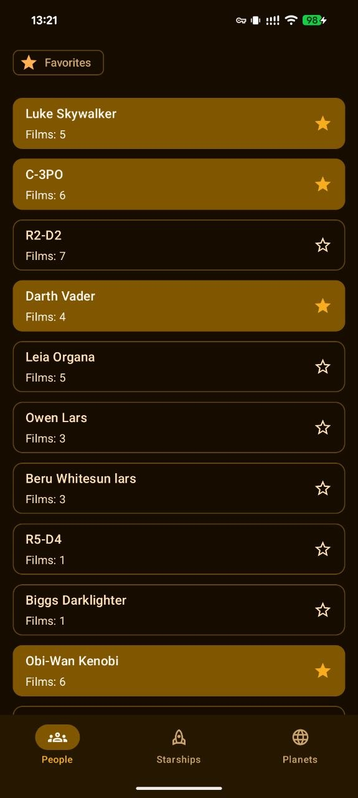
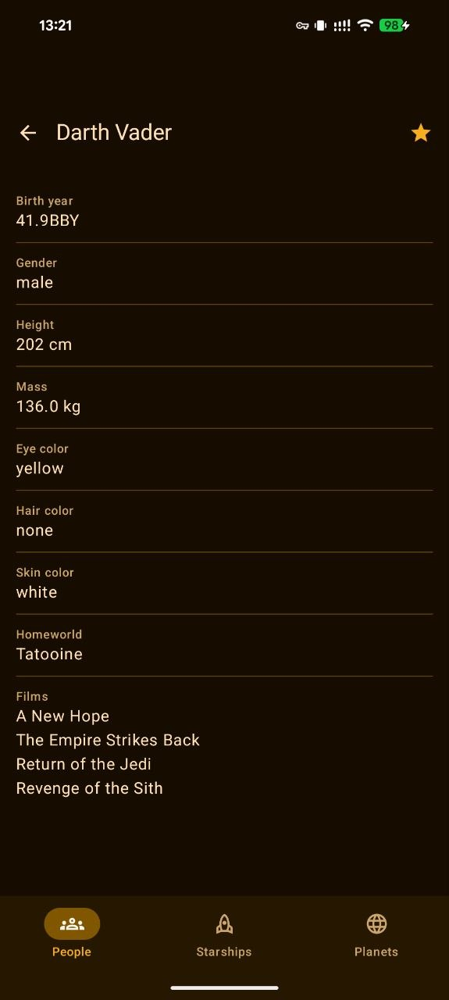
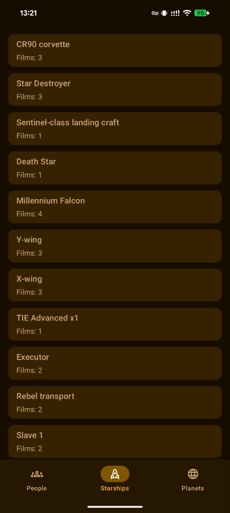

# StarWarsAtlas

A reference book app for the Star Wars universe, built with modern Android development stack

Data is fetched from the public GraphQL API: `https://swapi-graphql.eskerda.vercel.app/`

## Screenshots

| People                                        | Person Details                                                | Starships                                           |
|-----------------------------------------------|---------------------------------------------------------------|-----------------------------------------------------|
|  |  |  |

## Features

- **People** — browse Star Wars characters with details: birth year, gender, height, mass, eye/hair/skin color, homeworld, and film appearances
- **Starships** — browse starships with full specifications
- **Planets** — browse planets with detailed information
- Cursor-based infinite scrolling pagination for all catalog screens
- Offline-first with local Room cache — data is served from the database and refreshed from the network at most once per hour
- Error handling for network failures with retry support

## Tech Stack

| Area         | Library                                      |
|--------------|----------------------------------------------|
| Language     | Kotlin 2.3.20                                |
| UI           | Jetpack Compose + Material3 (BOM 2026.03.00) |
| Architecture | MVVM + Repository                            |
| DI           | Hilt 2.59.2                                  |
| Navigation   | Navigation Compose 2.9.7                     |
| Networking   | Apollo Client 4.4.2 (GraphQL)                |
| Pagination   | Paging 3 (Runtime + Compose) 3.4.2           |
| Local cache  | Room 2.8.4                                   |
| Preferences  | DataStore Preferences 1.2.1                  |
| Async        | Coroutines + StateFlow                       |
| Logging      | Timber 5.0.1                                 |

## Architecture

The app follows a single-module MVVM + Repository architecture:

```
com.okmyan.starwarsatlas
├── app/           # Application class, MainActivity, Navigation
├── core/          # Shared infrastructure
│   ├── model/     # DataError, Outcome
│   ├── network/   # Apollo client, connectivity interceptor
│   ├── paging/    # CursorRemoteMediator base class
│   ├── presentation/ # BaseViewModel
│   └── ui/        # Theme, reusable Compose components
├── di/            # Hilt modules
├── utils/         # Helpers and constants
└── feature/
    ├── people/
    ├── starships/
    └── planets/
```

Each feature is self-contained with `data/`, `domain/`, and `presentation/` layers.

List screens use **RemoteMediator** to page through GraphQL results and cache them in Room. Detail screens fetch data directly from the network on demand
